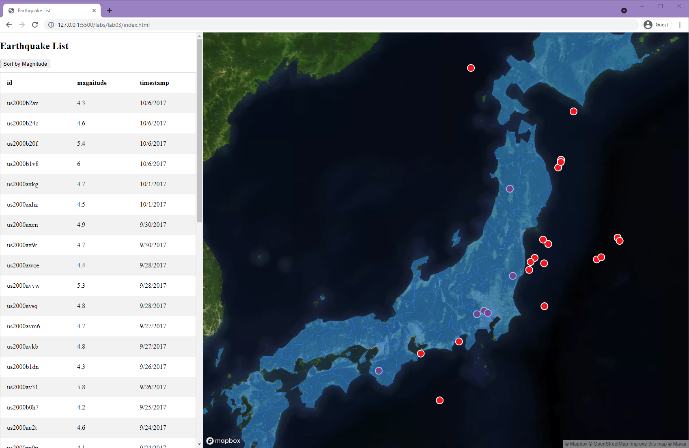
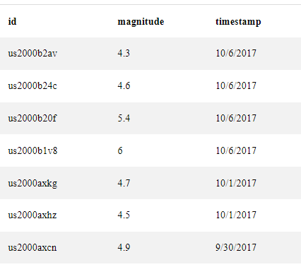
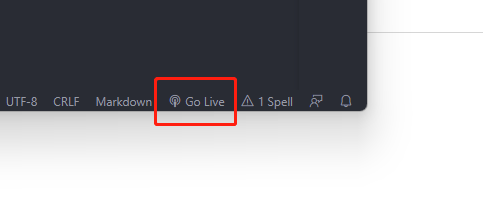

# Lab 3: Asynchronous GeoJSON Data Loading and Visualization

**Instructor:** Bo Zhao, 206.685.3846 or zhaobo@uw.edu

**Due:** Oct 29th, by 11:59pm | **Points Available** = 50

In this lab, we will exercise on loading geoJSON data asynchronously and visualize the data as table and map. Loading geospatial data will be frequently implemented in a Web or Mobile GIS. This lab will prepare you for this fundamental skill. With it, you can conduct more advanced geospatial analyses upon the loaded dataset. More specific, you will load two pieces of geojson data - one is a point format for the global distributed earthquakes, the other is a polygon format for all the counties in Japan. Once the data were loaded, the earthquake data will be shown in a table on the left of the window screen. The table can also sorted by the earthquake magnitude. The earthquake and the county boundaries can be plotted to the map on the right of the window screen. The map is built upon the mapbox library. At the end of this lab, you will be asked to create a web page in the same function but use another pieces of geospatial data. 



## 1. Create a new GitHub repository

Like the previous two labs, you need to create a new repository to complete this lab. We recommend you **give your repository a more descriptive name** instead of  using "geog495_lab03". 

Once the repository is created, please create a `readme.md` file, an `index.html`, an `earthquake.html`, and another `assets` folder to the root of this repo. In the directory for Lab 3, we saved two geojson files in the folder [assets](assets). Please move these two files to the assets folder of the newly build repository.

Now, the repository should follow the file structure below:

```powershell
[your_repository_name]
    │index.html
    │earthquake.html
    │readme.md
    ├─assets
    │      earthquakes.geojson
    │      japan.json

```

> **Note:** Before loading the data, I encourage you to evaluate these two pieces of geojson data. To do so, you can see whether these two files can be visualized correctly on [https://geojson.io](https://geojson.io).


> evaluate geojson data on geojson.io


## 2. Web content structure

To begin with, you need to create the skeleton of your html page. As we planed, this page will show a table of earthquake in a side panel on the left and a map of earthquakes on the right. Considering the general graphical user interface design, we create the skeleton of the html page as below.

```html
<!DOCTYPE html>
<html lang="en-US">
 <head>
 </head>
 <body>
    <main id="container">
        <div id="side-panel">
        </div>
        <div id="map"></div>
    </main>
 </body>   
<html>    
```

in the head element, we will include the mapbox library for map making, title, character set, an internal css holder. So, the `head` element looks as below.

```html
<head>
    <meta charset="utf-8">
    <title>Earthquake List</title>
    <meta name="viewport" content="initial-scale=1,maximum-scale=1,user-scalable=no">
    <link href="https://api.mapbox.com/mapbox-gl-js/v2.5.0/mapbox-gl.css" rel="stylesheet">
    <script src="https://api.mapbox.com/mapbox-gl-js/v2.5.0/mapbox-gl.js"></script>
    <style>
    </style>
</head> 
```

 The table is actually nested in the side panel on the left. There are three columns for each record, including `id`, `magnitude`, and `Timestamp`. On the top of the side panel, we show the name of this application and a button for sorting the table. To the end of parsing this html, we will run a piece of JavaScript snippet to load the data and implement the visualization. Therefore, a `script` element is added to the end of the `body` element. So, the `body` element should look as below.

 ```html
 <body>
    <main id="container">
        <div id="side-panel">

            <h2>Earthquake List</h2>
            <button>Sort by Magnitude</button>

            <table>
                <tr>
                    <th>id</th>
                    <th>magnitude</th>
                    <th>timestamp</th>
                </tr>
            </table>

        </div>
        <div id="map"></div>
    </main>
    <script>
    </script>
</body>
 ```

## 3. Style the html Page

Now that the skeleton of the html page was created, we will then add some css properties to style the html elements. In the style element in the head, we will add the following css properties.

```css
body {
    margin: 0;
    padding: 0;
}

#container {
    display: flex;
    height: 100vh;
    flex-direction: row;
    align-items: stretch;
}
```

These two selectors can make the main viewport of this html page can occupy the full window.


```css
#side-panel {
    flex-basis: 500px;
    overflow-y: scroll;
}

#map {
    flex-grow: 1;
}
```

Then we divide the main viewport to two parts, the side-panel on the left, while the map on the right. We use **flex display** to arrange these two elements. Flex is frequently used display strategy, it can responsively determine the size of space, and then extend or shrink the flex boxes. To apply the flex strategy, we need to declare the display property as flex for the container element of the designed flex boxes. In our cases, they are the side panel and the map.

```css
button {
    margin-bottom: 10px;
}
```
This button will keep a `10px` margin to the element at its bottom.

```css
table {
    border-collapse: collapse;
    border-spacing: 0;
    width: 100%;
    border: 1px solid #ddd;
}

th,
td {
    text-align: left;
    padding: 16px;
}

tr:nth-child(even) {
    background-color: #f2f2f2;
}
```

These properties will determine the style of the table. Notably, with tr:nth-child, the even rows in the table can be selected and their background color become a little grayer. Accordingly, the style for even rows and odd rows would be different.





## 4. Create a map instance

Now that the html page skeleton and the style have been determined, we will then create dynamic objects and increase interactivity.

We will use mapbox to create the map application. You wil need to apply for a mapbox access token from its official website. 

Once you obtain your own access token, please define a token at the beginning of the Javascript code.

```javascript
mapboxgl.accessToken = 'pk.eyJ1IjoiamFrb2J6aGFvIiwiYSI6ImNpcms2YWsyMzAwMmtmbG5icTFxZ3ZkdncifQ.P9MBej1xacybKcDN_jehvw';
```

Then, create a map object,  assign the container property to the right placeholder of the map. A base map layer is needed, in this lab, we choose the satellite imagery layer. In MapBox, each public-facing layer will have a unique style url. For satellite imagery, the url is 'mapbox://styles/mapbox/satellite-v9'. In addition, you need to also properly place the map and center the map. In this lab, the map is placed to the center of Japan. As shown in the code snippet below.

```javascript
let map = new mapboxgl.Map({
    container: 'map', // container ID
    style: 'mapbox://styles/mapbox/satellite-v9', // style URL
    zoom: 5.5, // starting zoom
    center: [138, 38] // starting center
});
```


## 5. Load GeoJSON asynchronously

The asynchronous data loading is an important feature of Web 2.0. Over the years, there have been multiple asynchronous approaches such as  timeout and interval, AJAX, promise  mechanism. More recent additions to the JavaScript language are async functions and the await keyword, added in ECMAScript 2017. These features basically act as syntactic sugar on top of promises, making asynchronous code easier to write and to read afterwards. They make async code look more like old-school synchronous code, we plan to use async and await for asynchronous geojson data loading.

> **Syntactic Sugar:** In computer science, syntactic sugar is syntax within a programming language that is designed to make things easier to read or to express. It makes the language "sweeter" for human use: things can be expressed more clearly, more concisely, or in an alternative style that some may prefer.

First of all we have the async keyword, which you put in front of a function declaration to turn it into an async function. An async function is a function that knows how to expect the possibility of the await keyword being used to invoke asynchronous code.

```javascript
async function geojsonFetch() { 
    // fetch geojson
 };

geojsonFetch();
```

The advantage of an async function only becomes apparent when you combine it with the await keyword. **await only works inside async functions within regular JavaScript code.** The await keyword causes the JavaScript runtime to pause your code on this line, not allowing further code to execute in the meantime until the async function call has returned its result — very useful if subsequent code relies on that result.

To load geojson data we use the fetch method, which provides an easy, logical way to fetch resources asynchronously across the network.

This kind of functionality was previously achieved using XMLHttpRequest. Fetch provides a better alternative that can be easily used by other technologies. In our lab,  two geojson objects are fetched. The simplest use of fetch() takes one argument — the path to the resource you want to fetch — and return the JSON response body to the response object. Then the response object is serialized as two geojson objects as earthquakes and japan. 


```javascript
async function geojsonFetch() {
    let response, earthquakes, japan, table;
    response = await fetch('assets/earthquakes.geojson');
    earthquakes = await response.json();
    response = await fetch('assets/japan.json');
    japan = await response.json();
};

geojsonFetch();
```


## 6. Add Map Layers


After the two geojson files are fetched, we will add them as two independent map layers. Apparently, the map layers should be loaded once the map has successfully created and loaded. So, the map layer generation functions will be implemented in the function that is stimulated by the map load event.

```javascript
//load data to the map as new layers and table on the side.
map.on('load', function loadingData() {

    map.addSource('earthquakes', {
        type: 'geojson',
        data: earthquakes
    });

    map.addLayer({
        'id': 'earthquakes-layer',
        'type': 'circle',
        'source': 'earthquakes',
        'paint': {
            'circle-radius': 8,
            'circle-stroke-width': 2,
            'circle-color': 'red',
            'circle-stroke-color': 'white'
        }
    });


    map.addSource('japan', {
        type: 'geojson',
        data: japan
    });

    map.addLayer({
        'id': 'japan-layer',
        'type': 'fill',
        'source': 'japan',
        'paint': {
            'fill-color': '#0080ff', // blue color fill
            'fill-opacity': 0.5
        }
    });

});
```

As shown in the code snippet above, each geojson data needs to be added to the map as a new data source (i.e., the addSource method of the map object), and then the layer can be added by indicating the name of source (i.e., the addLayer method of the map object). For each layer, the `paint` property can be used to define the style of geometric features. The value of the paint property is a list of declarations. Each declaration includes a style property name and the corresponding style property value.

By this step, you should see the map on the right portion of the browser window if you press the "Go Live" button on the status line at the bottom right.




## 7. Generate Table

Now that the map has been generated, let us create the earthquake list. This list will be made by the same geojson data for the earthquakes. So, it is unnecessary to fetch the geojson data again.

The code snippet selects the table element in the html page. Then, four variable are declared to create a row in the table. Each row stores three major parameters of an earthquake, including id, magnitude, and a timestamp. 


```javascript
table = document.getElementsByTagName("table")[0];
let row, cell1, cell2, cell3;
for (let i = 0; i < earthquakes.features.length; i++) {
    // Create an empty <tr> element and add it to the 1st position of the table:
    row = table.insertRow(-1);
    cell1 = row.insertCell(0);
    cell2 = row.insertCell(1);
    cell3 = row.insertCell(2);
    cell1.innerHTML = earthquakes.features[i].properties.id;
    cell2.innerHTML = earthquakes.features[i].properties.mag;
    cell3.innerHTML = new Date(earthquakes.features[i].properties.time).toLocaleDateString(
        "en-US");
}
```

It is worth noting that, there are multiple methods for html element selection in addition to `getElementsByTagName()`. Also,  an element object can assign HTML or text to its content by the property `innerHTML`.

By this step, you should also see the table in the side panel on the left.


## 8. Sort the Table

To sort the table by its magnitude level, we  first create a button named `Sort by Magnitude`, and then in the javascript, we add an click event for this button.

```javascript
let btn = document.getElementsByTagName("button")[0];

btn.addEventListener('click', sortTable);

// define the function to sort table
function sortTable(e) {

}

```

The sortTable function can compare two adjacent values and switch them if they are not in the right order. This compare located in a while loop. This loop will only stop when no switch is needed.


```javascript
// define the function to sort table
function sortTable(e) {
    let table, rows, switching, i, x, y, shouldSwitch;
    table = document.getElementsByTagName("table")[0];
    switching = true;
    /*Make a loop that will continue until
    no switching has been done:*/
    while (switching) {
        //start by saying: no switching is done:
        switching = false;
        rows = table.rows;
        /*Loop through all table rows (except the
        first, which contains table headers):*/
        for (i = 1; i < (rows.length - 1); i++) {
            //start by saying there should be no switching:
            shouldSwitch = false;
            /*Get the two elements you want to compare,
            one from current row and one from the next:*/
            x = parseFloat(rows[i].getElementsByTagName("td")[1].innerHTML);
            y = parseFloat(rows[i + 1].getElementsByTagName("td")[1].innerHTML);
            //check if the two rows should switch place:
            if (x < y) {
                //if so, mark as a switch and break the loop:
                shouldSwitch = true;
                break;
            }
        }
        if (shouldSwitch) {
            /*If a switch has been marked, make the switch
            and mark that a switch has been done:*/
            rows[i].parentNode.insertBefore(rows[i + 1], rows[i]);
            switching = true;
        }
    }
}
```


Now if you click the sort by magnitude button. All the listed earthquakes will be sorted from higher value of magnitude to lower value.

## 3. Deliverable

For your lab deliverable, we would like to ask you to convert your markdown wiki page for lab 1 to a website. After you finish making your website, please upload it to your newly created github repository and turn on the GitHub Pages function, so that we can take a look at your website without using a local web server. Feel free to use the template that we went through in Section 2. You can also create your own website if you want, as long as it is well organized.

We expect the followings for your deliverable:

- Create a new GitHub repository. (3 pts)

- The GitHub Pages function is enabled (we can see your website by visiting `http://[your_github_username].github.io/[your_repository_name]/index.html`). (3 pts)

- The navigation bar is well designed and responsive (try adjust the `max-width` value to make it suit your navigation bar content) (6 pts)

- The navigation bar color, the `hover` color, and the `active` color should be changed based on your preference. (6 pts)

- For the webpage content, you should adopt at least 3 more customized styles following the instructions from [W3Schools How TO - Code snippets for HTML, CSS and JavaScript](https://www.w3schools.com/howto/). For example, you can [add a fullscreen video as the background of your home page](https://www.w3schools.com/howto/howto_css_fullscreen_video.asp), or [create a summarizing table for your topic](https://www.w3schools.com/howto/howto_css_table_zebra.asp), just like what you often see in a Wikipedia entry. Also, if you want to redesign some of your webpages, feel free to do so! (Two example templates here are 1) [Meet The Team Page](https://www.w3schools.com/howto/howto_css_team.asp) and 2) [Section Counter](https://www.w3schools.com/howto/howto_css_section_counter.asp)) Be creative and feel free to edit the information on your wiki page based on the customized element you choose! (21 pts)

- At least one multimedia element, for example, an image or a video (You should keep an eye on the size of the multimedia element you put, as you don't want it to be much larger than your window size). (6 pts)

- Please make sure the internal structure of the files in your repository is well organized. For example, it may be similar to the file structure below. (5 pts)

  ```
  [your_repository_name]
      │index.html
      │html2.html
      |html3.html
      │readme.md
      ├─css
      │      main.css
      ├─img
      │      xxx.jpg
      └─js
             main.js
  ```


## Acknowledgement

The code for the website template is adapted from [How To Create a Responsive Top Navigation Menu (w3schools.com)](https://www.w3schools.com/howto/howto_js_topnav_responsive.asp).


References:
- [Zebra Striped Table](https://www.w3schools.com/howto/howto_css_table_zebra.asp)
- [Sort a Table](https://www.w3schools.com/howto/howto_js_sort_table.asp)
- [async and await](https://developer.mozilla.org/en-US/docs/Learn/JavaScript/Asynchronous/Async_await)