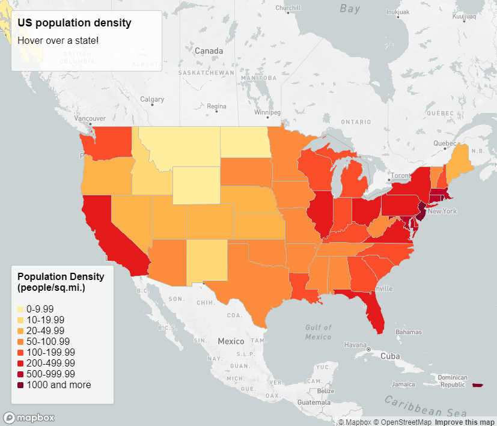
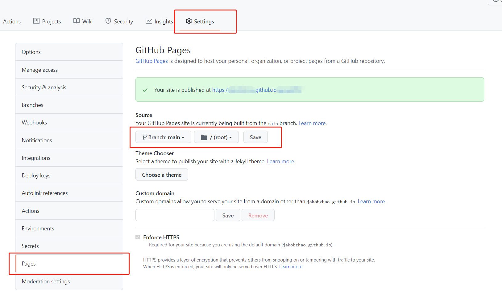

# Lab 4: Interactive Web Mapping

**Instructor:** Bo Zhao, 206.685.3846 or zhaobo@uw.edu

 **Points Available** = 50

In this lab, we will make an interactive choropleth web map that allows you to see more information when hovering above certain areas. You will be guided to make a web map showing state-level population densities in the U.S. You will load a local GeoJSON file and add it as a map layer, similar to what you did in our previous lab. Then you will need to use different colors for different population density values, add a title and a legend. Lastly and most importantly, you will write code that allow you to see specific values when you hover your mouse over a specific state. As for your final deliverable for this lab, you will be asked to create a different interactive choropleth map using the COVID-19 related dataset that we provide.



## 1. Create a new GitHub repository

Like the previous two labs, you need to create a new repository to complete this lab. We recommend you **give your repository a more descriptive name** instead of  using "geog328_lab04". 

Once the repository is created, please create a `readme.md` file, an `index.html`, an `pop_density.html`, and another `assets` folder to the root of this repo. In the directory for Lab 4, we saved two geojson files in the folder [assets](assets). Please move these two files to the assets folder of the newly build repository.

Now, the repository should follow the file structure below:

```powershell
[your_repository_name]
    │index.html
    │pop_density.html
    │readme.md
    ├─assets
    │      stateData.geojson
    │      wa-covid-data-102521.geojson

```
**Once you have created and downloaded the files, you can follow the steps below to edit your `pop_density.html`**

## 2. Web content structure & CSS Style

This section is similar to what you saw in the previous lab. First, we lay out a general html structure. Then we use internal CSS to style the html elements.

### 2.1 HTML

First, we create the skeleton of the html page as below.

```html
<!DOCTYPE html>
<html>

<head>
</head>

<body>
    <div id="map"></div>
    <div class='map-overlay' id='features'>
        <h2>US population density</h2>
        <div id='text-description'>
            <p>Hover over a state!</p>
        </div>
    </div>
    <div class='map-overlay' id='legend'></div>
    <script>
    </script>

</body>

</html>
```

In the `body` element, we have a placeholder for our **map** (`<div id="map">`), one for our **title and hovering text** (`<div class='map-overlay' id='features'>`), and another one for **legend** (`<div class='map-overlay' id='legend'>`).

In the `head` element, we will include the mapbox library for map making, title, character set, an internal css holder.

```html
<head>
    <meta charset="utf-8">
    <title>Interactive Web Mapping</title>
    <meta name="viewport" content="initial-scale=1,maximum-scale=1,user-scalable=no">
    <link href="https://api.mapbox.com/mapbox-gl-js/v2.5.0/mapbox-gl.css" rel="stylesheet">
    <script src="https://api.mapbox.com/mapbox-gl-js/v2.5.0/mapbox-gl.js"></script>
    <style>
    </style>
</head> 
```


### 2.2 CSS

We first customize the styles for the basic html elements `<h2>`, `<h3>`, and `<p>`. 

```css
h2, h3 {
    margin: 10px;
    font-size: 18px;
}

h3 {
    font-size: 16px;
}

p {
    margin: 10px;
}
```

Then we set the style for our `map`. 

```css
#map {
    position: absolute;
    top: 0;
    bottom: 0;
    left: 0;
    right: 0;
    width: 100%;
}
```

After that, we set the styles for our `map-overlay` elements (i.e., our title box and legend box). We first set the general style for the container boxes using `.map-overlay {}`, then we add specific styles for the title content and the legend content. Although we haven't seen the `legend-key` class yet, this is for each entry (line) in the legend that will be added by JS later.

```css
.map-overlay {
    position: absolute;
    bottom: 0;
    left: 0;
    background: rgba(255, 255, 255, 0.8);
    border-style: solid;
    border-width: 1px;
    border-color: rgba(0, 0, 0, 0.2);
    margin-left: 20px;
    font-family: Arial, sans-serif;
    overflow: auto;
    border-radius: 3px;
}

#features {
    top: 0;
    height: 100px;
    margin-top: 20px;
    width: 250px;
}

#legend {
    padding: 10px;
    box-shadow: 0 1px 2px rgba(0, 0, 0, 0.1);
    line-height: 18px;
    height: 210px;
    margin-bottom: 40px;
    width: 150px;
}

.legend-key {
    display: inline-block;
    border-radius: 20%;
    width: 10px;
    height: 10px;
    margin-right: 5px;
}
```

In the end, we have a CSS fix for making your cursor look normal. You can try to remove this CSS style and see what will happen.

```css
.mapboxgl-canvas-container.mapboxgl-interactive,
.mapboxgl-ctrl-group button.mapboxgl-ctrl-compass {
    cursor: unset;
}
```

## 3. Use JavaScript to make the map

You should already be familiar with how to create a map using [Mapbox GL JS API](https://docs.mapbox.com/mapbox-gl-js/guides/) to create a map and add a GeoJSON file as a map layer after going through the previous lab.

### 3.1 Create a map instance

First, we create a map instance to initialize the map. This time we will use another base map from Mapbox, which is `light-v10`. For more Mapbox styles, please take a look at [here](https://docs.mapbox.com/api/maps/styles/#mapbox-styles). Also, this time we will put the map center in the contiguous U.S.

```javascript
mapboxgl.accessToken = 'pk.eyJ1IjoiamFrb2J6aGFvIiwiYSI6ImNpcms2YWsyMzAwMmtmbG5icTFxZ3ZkdncifQ.P9MBej1xacybKcDN_jehvw';

const map = new mapboxgl.Map({
        container: 'map', // container ID
        style: 'mapbox://styles/mapbox/light-v10', // style URL
        zoom: 3, // starting zoom
        center: [-100, 40] // starting center
    }
);
```

### 3.2 `async function`

Then, we will again use the `async function` for our following operations, including loading the GeoJSON file, adding it as a map layer, adding content to our legend, and implementing the hovering effect.

```javascript
async function geojsonFetch() { 
    // other operations
}

geojsonFetch();
```

### 3.3 Load GeoJSON file

**Starting from this section, all of the code needd to be within the async function `geojsonFetch()` to avoid errors related to the data file not being properly loaded.**

We can load our GeoJSON file `stateData.geojson` by using the code below.

```javascript
let response = await fetch('assets/stateData.geojson');
let stateData = await response.json();
```

### 3.4 Add map layer

Like what we did in our previous lab, we will add our map layer when the map is loaded. In other words, we need to set an event listener that fires when the map has finished loading. In our case, the callback function `loadingData()` will be fired when the map has finished loading.

```javascript
map.on('load', function loadingData() {
    // add layer
    // add legend
});
```

> What is a **callback**?
>
> Initializing the map on the page does more than creating a container in the `map` div. It also tells the browser to request the Mapbox base map of your choice so that you could see a complete base map. This can take variable amounts of time depending on how quickly the Mapbox server can respond to that request, and everything else you're going to add in the code relies on that style being loaded onto the map. As such, it's important to make sure the map style is loaded before any more code is executed.
>
> Fortunately, the map object can tell your browser about certain events that occur when the map's state changes. One of these events is `load`, which is emitted when the style has been loaded onto the map. Through the `map.on` method, you can make sure that none of the rest of your code is executed until that event occurs by placing it in a [callback function](https://github.com/maxogden/art-of-node#callbacks) that is called when the `load` event occurs.

We use the code snippet below to add the map layer and set the style.

```javascript
map.addSource('stateData', {
    type: 'geojson',
    data: stateData
});

map.addLayer({
    'id': 'stateData-layer',
    'type': 'fill',
    'source': 'stateData',
    'paint': {
        'fill-color': [
            'step',
            ['get', 'density'],
            '#FFEDA0',   // stop_output_0
            10,          // stop_input_0
            '#FED976',   // stop_output_1
            20,          // stop_input_1
            '#FEB24C',   // stop_output_2
            50,          // stop_input_2
            '#FD8D3C',   // stop_output_3
            100,         // stop_input_3
            '#FC4E2A',   // stop_output_4
            200,         // stop_input_4
            '#E31A1C',   // stop_output_5
            500,         // stop_input_5
            '#BD0026',   // stop_output_6
            1000,        // stop_input_6
            "#800026"    // stop_output_7
        ],
        'fill-outline-color': '#BBBBBB',
        'fill-opacity': 0.7,
    }
});
```

This is a little bit different from what we saw in our previous lab, as we adopted a new strategy - `step` - for coloring the polygons.

According to the [Mapbox GL JS API documentation for `step`](https://docs.mapbox.com/mapbox-gl-js/style-spec/expressions/#step):

**NOTE: We spotted an error in the Mapbox's API Documentation while we were creating this lab tutorial, please refer to the corrected information below for how to use `step`.**

> [**Step**] produces discrete, stepped results by evaluating a piecewise-constant function defined by pairs of input and output values ("stops"). The `input` may be any numeric expression (e.g., `["get", "population"]`). Stop inputs must be numeric literals in strictly ascending order. Returns the output value of the stop just less than the input, or the ~~first output if the input is less than the first stop~~ *last output if the input is equal to or larger than the last stop*.
>
> **Syntax**
>
> ```javascript
> ["step",
>   input: number,
>   stop_output_0: OutputType, stop_input_0: number,
>   stop_output_1: OutputType, stop_input_1: number,
>   ...
>   stop_output_n: OutputType, stop_input_n: number, 
>   stop_output_n+1: OutputType
> ]: OutputType
> ```

Here we used another [expression](https://docs.mapbox.com/mapbox-gl-js/style-spec/expressions/?size=n_10_n) `['get', 'density']` for `input`, which means to *get* the ***density*** attribute in our GeoJSON file to be used as the input value. If you want to use another attribute in your geojson data for coloring your map, you can use `['get', 'attribute_name']` and then change the stop input values to re-color your map.

Therefore, to put the `fill-color` code in everyday language:

```javascript
'fill-color': [
    'step',      // use step expression to provide fill color based on values
    
    ['get', 'density'],  // get the density attribute from the data
    
    '#FFEDA0',   // use color #FFEDA0
    10,          // if density < 10
    
    '#FED976',   // use color #FED976
    20,          // if 10 <= density < 20
    
    '#FEB24C',   // use color #FEB24C
    50,          // if 20 <= density < 50
    
    '#FD8D3C',   // use color #FD8D3C
    100,         // if 50 <= density < 100
    
    '#FC4E2A',   // use color #FC4E2A
    200,         // if 100 <= density < 200
    
    '#E31A1C',   // use color #E31A1C
    500,         // if 200 <= density < 500
    
    '#BD0026',   // use color #BD0026
    1000,        // if 500 <= density < 1000
    
    "#800026"    // use color #800026 if 1000 <= density
],
```

After providing the fill colors, we add an outline color by using:

```javascript
'fill-outline-color': '#BBBBBB',
```

We can also give some opacity to the polygons, so that we could also see some information from the base map.

```javascript
'fill-opacity': 0.7,
```


### 3.4 Add a legend

In this lab, we also use JavaScript to add content to the empty legend information box, after the map layer is successfully added to the map. Many people also choose to add legend directly through HTML, which is also a very common practice. But in this lab we will stick to using JS.

#### 3.4.1 Create arrays of intervals and colors.

Creating a list of the stops you used when styling your layer that contains state data will allow us to add a legend to our map in a later step.

```javascript
const layers = [
    '0-9',
    '10-19',
    '20-49',
    '50-99',
    '100-199',
    '200-499',
    '500-999',
    '1000 and more'
];
const colors = [
    '#FFEDA070',
    '#FED97670',
    '#FEB24C70',
    '#FD8D3C70',
    '#FC4E2A70',
    '#E31A1C70',
    '#BD002670',
    '#80002670'
];
```

For the color values, you can notice that the there is a `70` at the end of the values that we used for coloring the polygons, this is for [hex code colors with alpha values](https://www.digitalocean.com/community/tutorials/css-hex-code-colors-alpha-values). This correspond with the opacity value `0.7` we set for our polygons.

> Using an alpha value to update a color’s transparency will change the hex code format from `#RRGGBB` to `#RRGGBBAA` (where alpha is `A`). The first six values (the red, green, and blue ones) remain the same.
>
> The `AA` value in `#RRGGBBAA` can range from the lowest value possible (`00`) to the highest value possible (`FF`). Lowering the value will cause the visibility to become fainter and fainter until it becomes transparent. Raising the value will cause the visibility to become more and more opaque.

#### 3.4.2 Add the legend

The following code adds a legend to the map. We first set the legend title. Then, we iterate through the list of layers you defined above and add a legend element for each one based on the name of the layer and its color.

```javascript
const legend = document.getElementById('legend');
legend.innerHTML = "<b>Population Density<br>(people/sq.mi.)</b><br><br>";

layers.forEach((layer, i) => {
    const color = colors[i];
    const item = document.createElement('div');
    const key = document.createElement('span');
    key.className = 'legend-key';
    key.style.backgroundColor = color;

    const value = document.createElement('span');
    value.innerHTML = `${layer}`;
    item.appendChild(key);
    item.appendChild(value);
    legend.appendChild(item);
});
```

Now you should be able to see the legend if you save your code and refresh your page.

#### 3.5 Add the information window

When the cursor is hovering over a state, the information window should show the population density information for that state. If the cursor is not hovering over a state, the information window should say, "Hover over a state!"

To do this, add a listener for the `mousemove` event, identify which state is at the location of the cursor if any, and update the information window:

```javascript
map.on('mousemove', ({point}) => {
    const state = map.queryRenderedFeatures(point, {
        layers: ['stateData-layer']
    });
    document.getElementById('text-description').innerHTML = state.length ?
        `<h3>${state[0].properties.name}</h3><p><strong><em>${state[0].properties.density}</strong> people per square mile</em></p>` :
        `<p>Hover over a state!</p>`;
});
```

First, you store the state data, which is the location of your cursor at, from your map layer `stateData-layer` in a new constant variable `state`. After that,`state[0].properties.name` is how you can access the `name` attribute value in your data, and similarly, `state[0].properties.density` is how you can access the `density` attribute value in your data.


Now if the cursor is hovering over a state, the information window should show the population density information for that state.


## 4. Sharing on GitHub Page

Now we will publish this repository as a web application. As always, commit the local updates, and then push/synchronize these commits to the repo on the github. To transform this remote repo as a web page, you will need to navigate from **`Settings --> Pages`**, in the source section, choose your site is built from the `Branch:main`, under the `root` of the repo. Keep the parameters under other sections like `Theme Chooser`, `custom domain`, `enforce HTTPS` as default values. After you press the save button under the source section, you will be notified where the site has been published to on the current screen. You can visit the population density map through [https://[username].github.io/[your_repo_name]/pop_density.html](https://[username].github.io/[your_repo_name]/pop_density.html).




## 5. Deliverable

For your lab deliverable, we would like to ask you to create another map using the `wa-covid-data-102521.geojson` data we provided ([Right click here and choose "save link as"](assets/wa-covid-data-102521.geojson) to download the geojson file, or you can find it in the course github repo at `geog328/labs/lab04/assets/wa-covid-data-102521.geojson`). 

This data file includes the 1) **cumulative COVID-19 case rate (per 10k people)**, 2) cumulative COVID-19 death rate (per 10k people), and 3) **fully vaccinated rate (per 10k people)** in every Washington county until Oct. 25th, 2021. All of the numeric values are rounded to the nearest integer.

> In this data there are four attributes - "name", "casePer10k", "deathPer10k", and "fullyVaxPer10k".
>
> - name- the name of the county
> - casePer10k - cumulative cases per 10k people within the county
> - deathPer10k - cumulative deaths per 10k people within the county
> - fullyVaxPer10k- number of people who are fully vaccinated per 10k people within the county
>
> Original data sources:
>
> - The COVID-19 case and death data is from [The New York Times](https://github.com/nytimes/covid-19-data).
>
> - The COVID-19 vaccination data is from [Washington State Department of Health](https://www.doh.wa.gov/emergencies/covid19/datadashboard#tables).
>
> - The 2021 population estimates data used for calculating the rates is from [Washington State Office of Financial Management](https://ofm.wa.gov/washington-data-research/population-demographics/population-estimates/april-1-official-population-estimates).
>
> - The cartographic boundary data is from [U.S. Census Bureau](https://www.census.gov/geographies/mapping-files/time-series/geo/carto-boundary-file.html).

Your job is to choose any one of the three attributes and make a new map accordingly. Your web map should be compiled in the `index.html` page. **You are expected to submit the url of the GitHub repository to the Canvas Dropbox of this course. This url should be in the format of `http://[your_github_username].github.io/[your_repository_name]/index.html`**

We expect the followings for your deliverable:

- Create a new GitHub repository. (3 pts)

- The population density example can be found at `http://[your_github_username].github.io/[your_repository_name]/pop_density.html`). (3 pts)

- The GitHub Pages function is enabled (we can see your map by visiting `http://[your_github_username].github.io/[your_repository_name]/index.html`). (4 pts)


- Your web map is based on the the `wa-covid-data-102521.geojson` data. (3 pts)

- Your webpage should be updated based on the data you choose for your web map. (35 pts)


    - An appropriate webpage title (i.e., what's in the `<title>` element). (3 pts)
    - An appropriate map title. (3 pts)
    - Make sure that your map shows the right geographic area when it loads for the first time. (3 pts)
    - An appropriate color scheme for your choropleth map. (8 pts)
    - A well-designed legend. (9 pts)
    - The hovering function should work properly and show the correct data. (9 pts)

- Please make sure the internal structure of the files in your repository is well organized. For example, it may be similar to the file structure below. (5 pts)

  ```powershell
  [your_repository_name]
      │index.html
      │pop_density.html
      │readme.md
      ├─assets
      │      stateData.geojson
      │      wa-covid-data-102521.json
  
  ```


## References:

- [Make a choropleth map, part 1: create a style | Help | Mapbox](https://docs.mapbox.com/help/tutorials/choropleth-studio-gl-pt-1/)
- [Make a choropleth map, part 2: add interactivity | Help | Mapbox](https://docs.mapbox.com/help/tutorials/choropleth-studio-gl-pt-2/)

- [Mapbox GL JS | Mapbox](https://docs.mapbox.com/mapbox-gl-js/guides/)
- [nytimes/covid-19-data: An ongoing repository of data on coronavirus cases and deaths in the U.S. (github.com)](https://github.com/nytimes/covid-19-data)

- [COVID-19 Data Dashboard :: Washington State Department of Health](https://www.doh.wa.gov/emergencies/covid19/datadashboard#tables)
- [April 1 official population estimates | Office of Financial Management (wa.gov)](https://ofm.wa.gov/washington-data-research/population-demographics/population-estimates/april-1-official-population-estimates)
- [Cartographic Boundary Files - Shapefile (census.gov)](https://www.census.gov/geographies/mapping-files/time-series/geo/carto-boundary-file.html)

