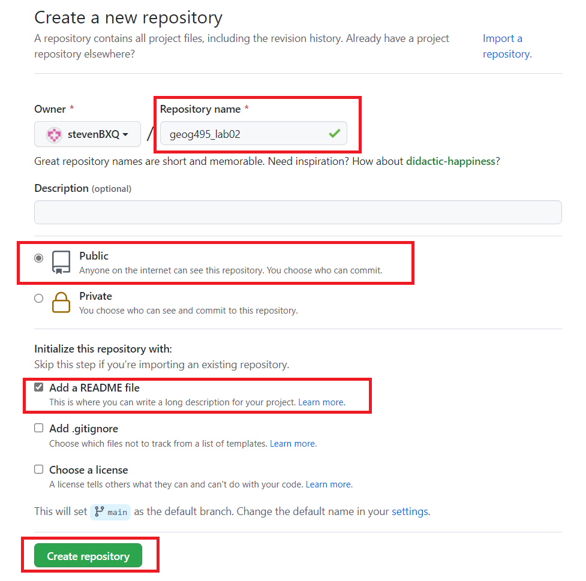
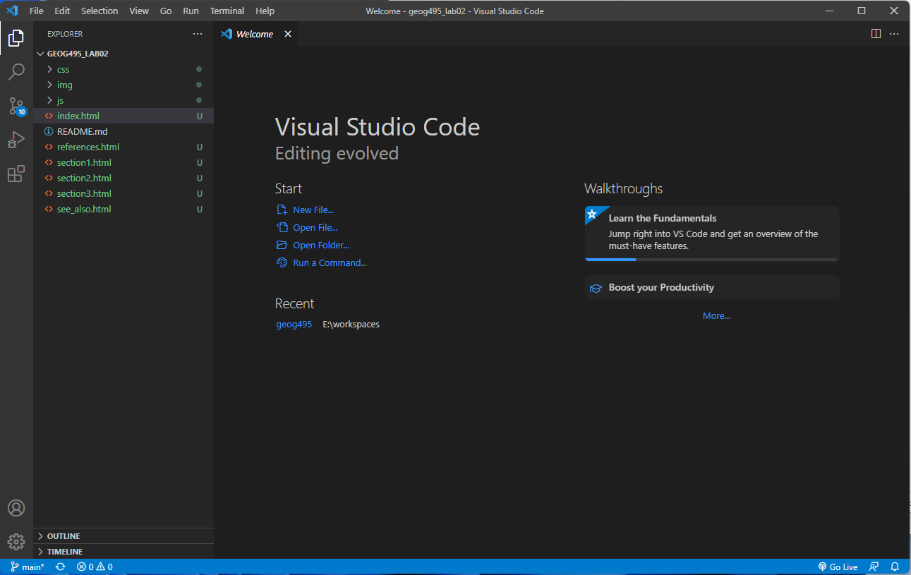
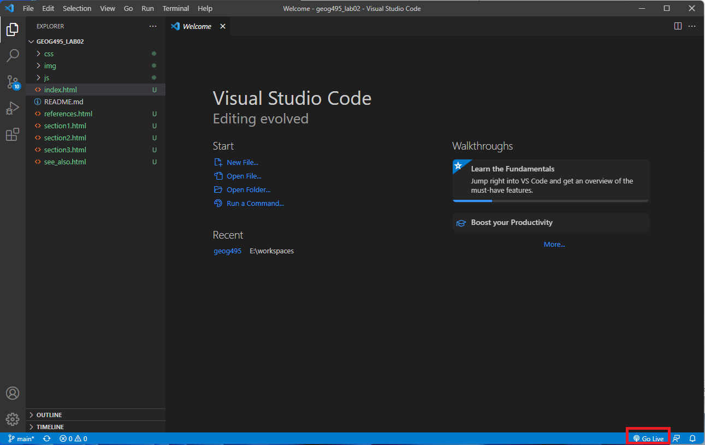
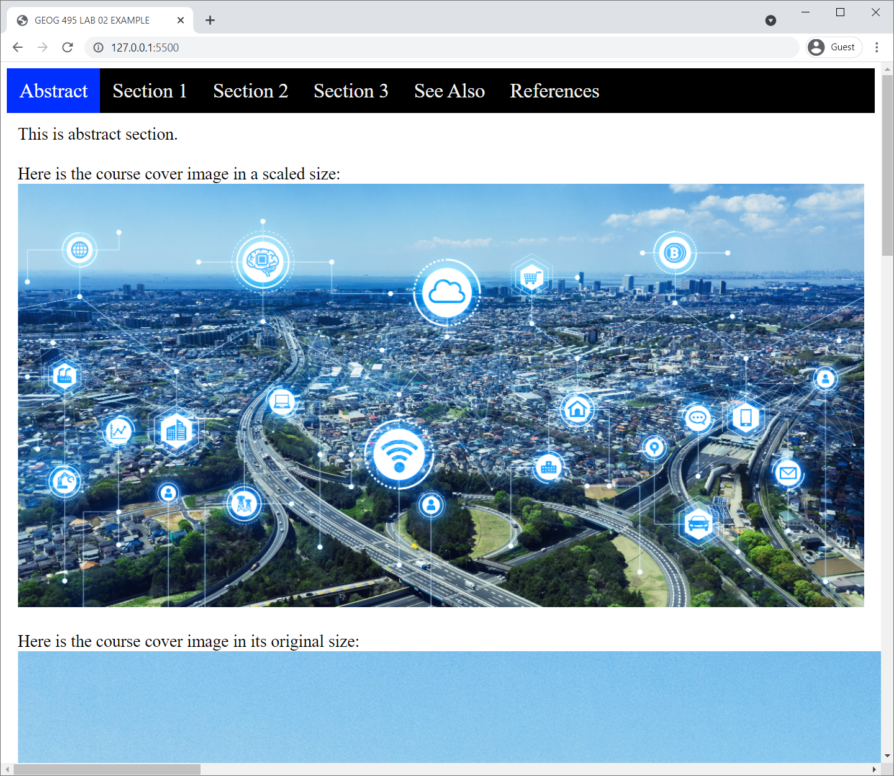

# Lab 2: Responsive Web Page Design

**Instructor:** Bo Zhao, 206.685.3846 or zhaobo@uw.edu

 **Points Available** = 50

In this lab, we will exercise on how to build a simple website with a responsive (i.e., being able to change its layout based on the size of the screen) navigation bar. You will practice writing code in HTML, CSS, and JavaScript, and then combine them together to create your own website. At the end of this lab, you will be asked to convert the wiki page you created in lab 1 into a website.

## 1. Create a new GitHub repository

Recalling what we did in lab 1, you should **create a new public GitHub repository** for this lab and give it a name. We recommend you to **give your repository a more descriptive name** instead of  using "geog328_lab02" It is also recommended to **add a README file** to your repo. If you have the opportunity to look at some repositories on GitHub, you will find that most of them have a README file, which serves as **a brief description of the project**. You can read more about the functionality of READMEs [**here**]([About READMEs - GitHub Docs](https://docs.github.com/en/repositories/managing-your-repositorys-settings-and-features/customizing-your-repository/about-readmes)).



**After you create your own repo, clone it to your local computer. Then copy and paste the lab material from the course repository. You can find the lab material at `geog328/labs/lab02`.**

## 2. Explore the files

In this section, we will go over the provided website template to get you familiar with the structure of a website as well as the web-programming code.

### 2.1 Set up your computer as a local web server

Websites live on web servers. So here we will use the Visual Studio Code plugin `Live Server` that we installed in Lab 1 to turn our own computer into a web server. In this way, your local computer will be both a **Client** (as you use it to browse your website) and a **Server** (as you also use it to host your website).

Open `Visual Studio Code` and open the folder for the new repository you created. You will see something like this:

> Note: Remember to copy the lab material from the course repository (`geog328/labs/lab02`) to your own repository folder; otherwise you will just see an empty folder (or only with an README.md in it)!



If you have installed the `Live Server` plugin correctly, you should be able to see the `Go Live` button at the bottom right corner of your VSCode window.



Click on the `Go Live` button, in a few seconds, a new browser window will pop up. This means that your local server has been successfully set up!



> **Note**: In the address bar, you see `127.0.0.1:5500`. `127.0.0.1` is a special IP address called **loopback** address. Unlike other IP addresses, which direct to other computers in the network, it always directs to the local machine itself. The number `5500` is the **port number**. One port can only be used for one service. Here the `Live Server` plugin establishes a local webserver on port 5500. You may see it using a different port number sometimes. That means the default port `5500` is actually being used by another service on your computer, so that `Live Server` plugin has to choose another port to run on.

Try to change the window size and you will find that the navigation bar on the top have two different layouts. If you shrink the window width to a certain extent, the navigation bar will change to a more mobile friendly layout.

### 2.2 A deeper look into the files

You can see the file structure as below:

```
[your_repository_name]
    │index.html
    │section1.html
    │section2.html
    │section3.html
    │see_also.html
    │references.html
    │readme.md
    ├─css
    │      main.css
    ├─img
    │      xxx.jpg
    │      xxx.png
    └─js
           main.js
```

In the root folder, there are your `.html` and `readme.md` files. The `index.html` file is the default page. If you type `127.0.0.1:5500` into your address bar and hit enter, you will see exactly the same when you use `127.0.0.1:5500/index.html`. 

Then we have separate folders for images, JavaScript files, and CSS files. You may wonder why we need a dedicated folder for one `.css` or`.js` file. This lab only guides you to make a very simple website. In the future, you will encounter situations where you need multiple different `.css` or `.js` files to be included in your  HTML. Setting up folders for different files types will make your project folder/repository clean and organized.

#### 2.2.1 HTML

Let's first take a look into the `index.html` file. Open it in `Visual Code Studio`. 

**`<head>` tag:**

```html
<head>
    <title>GEOG 328 LAB 02 EXAMPLE</title>

    <link rel="stylesheet" href="css/main.css">
    <link rel="stylesheet" href="https://cdnjs.cloudflare.com/ajax/libs/font-awesome/4.7.0/css/font-awesome.min.css">
</head>
```

In the `<head>` tag, we have `<title>GEOG 328 LAB 02 EXAMPLE</title>` to define the website title, then we link the customized `.css` file. In addition, we see reference to a `font-awesome.min.css` file, which is used for getting the icon image for the hamburger button in the mobile version layout.

**`<body>` tag:**

In the `<body>` tag, we have two different `<div>` tags, one is for the navigation bar, the other is for the page content. Let's look at them one by one.

**`<div class="topnav" id="myTopnav">` tag**:

```html
<div class="topnav" id="myTopnav">
    <a class="active" href="index.html">Abstract</a>
    <a href="section1.html">Section 1</a>
    <a href="section2.html">Section 2</a>
    <a href="section3.html">Section 3</a>
    <a href="see_also.html">See Also</a>
    <a href="references.html">References</a>
    <!-- "Hamburger menu" / "Bar icon" to toggle the navigation links -->
    <a href="javascript:void(0);" class="icon">
        <i class="fa fa-bars"></i>
      </a>
</div>
```

In the first `<div>` tag, we define it to be in the `topnav` class with a specific id `myTopnav`. Then in there, we have six `<a>` tags, each correspond with an element in the navigation bar. For the first tag for "Abstract", we make it as an `active` class, indicating that this is the currently active section. By assigning it to a different class, we can define a different CSS style for it, which we will see later. In the `href` attribute, we put the file address for the corresponding `.html` file.

The last `<a>` tag is a bit different, as it defines the hamburger menu button for the narrower view. `href` attribute usually means to open a new link. But here we use `href="javascript:void(0);"` to make it do nothing, as our intended function for it is not to open a new page. Then we make it a different "icon" class for CSS styling purpose. Then inside the `<a>` tag, we use `<i class="fa fa-bars"></i>` to add the hamburger icon. This is achieved by [Font Awesome](https://fontawesome.com/) API. If you want to know more about how to use it in your future work, click [here](https://fontawesome.com/v5.15/how-to-use/on-the-web/referencing-icons/basic-use). We will customize the behavior for clicking on the button by using Javascript, which will be introduced later.

**`<div class="content">` tag:**

```html
<div class="content">
    This is abstract section.
    <br>
    <br>
    Here is the course cover image in a scaled size:
    <br>
    
    <br>
    <br>
    Here is the course cover image in its original size:
    
</div>
```

This tag is for the main content you see on the website. As you can see, we use `<br>` for starting a new line. `` tag for adding an image. Inline CSS is also used here by adding `style` attribute to make the image be responsive as well. For the first image, if you resize the browser window, the image size will adjust automatically.

**`<script>`tag:**

```html
<script src="js/main.js"></script>
```

At the end of the html, we include the JavaScript file. We put it at the end because in the `.js` file we are going to access an html element. If we put this `<script>` tag before the `<body>` part, we will receive an error message in console when loading the website, telling us that the js code cannot find the specific element, as the code hasn't reached the part for creating the tag yet. 


Above is a detailed explanation of how each part of the `index.html` file works. The other several `.html` files are for other sections you can see in the navigation bar. Their general structures are very similar. The only differences are 1) the `active` class should be assigned to the current page. 2) the page content.

#### 2.2.2 CSS

Open the `css/main.css` file.

The comments for the `main.css` file did a very good explanation of what each code block is doing. Don't be scared by all these different CSS properties! You don't need to memorize how each property works. [Here](https://cssreference.io/) is a good reference for you to learn about how each CSS property works. Feel free to use Google or any resource you think is helpful! Try editing some properties and refresh the webpage to see how the page will change could also help you get a better understanding of CSS!

While the first 40 lines define the basic style for our webpage, **the lines from 41-70 are the key to make our webpage responsive.** 

`@media screen and (max-width: 800px)` [media query](https://developer.mozilla.org/en-US/docs/Web/CSS/Media_Queries/Using_media_queries) is applied when the browser width is smaller that `800px`.

The first media query is used for showing/hiding the hamburger menu button that we see on smaller window size.

The second media query is used for changing the style for the unfolded vertical navigation bar on smaller window size.

#### 2.2.3 JavaScript

This lab requires relatively little amount of JavaScript. But it also is crucial here for changing the style of our navigation bar when the window resizes. 

Here is the logic of how it works:

From the previous CSS section, we know that: 

1) When we see the hamburger menu button, we are already in the mobile version, which means that our navigation bar has been folded to suit the mobile view. 
2) Our previously defined style for `topnav` now only works well for the *folded* navigation bar.

**So now we need a *new* style for the *unfolded* navigation bar. And this is where the js code comes into play.**

First, we need to locate the element that will be clicked on when someone tries to fold/unfold the navbar. Therefore, we use the line of code below to get the corresponding tag and save it in a variable.

```javascript
let icon = document.getElementsByClassName("icon")[0];
```

The `document.getElementsByClassName()` function will return an array with all the elements with the same class name. Here we only have one element with the class name `icon`, so we can get the element by using index `0`.

Then, by using the code below, we will add a `click` event to this element. When the `icon` element (i.e., the hamburger menu button) is clicked, the function `responsive_control` will be called immediately.

```javascript
icon.addEventListener('click', responsive_control);
```


When `responsive_control` is called, it searches for the element with the id `myTopnav` and stores it it a variable named `x`.

Before any action, the original navigation bar should have the predefined class name `topnav`. When we click on the menu button, we change it from `topnav` to `topnav responsive`. So that the unfolded navigation bar could use the style we defined for `topnav responsive` in our `.css` file.

When the navigation bar is unfolded and we want to fold it again, we can just change the class name from `topnav responsive` back to `topnav`, so that the style of the navigation bar will change correspondingly.

Then we wrap the code into a function named `responsive_control`, and we have the code below:

```js
function responsive_control() {
  let x = document.getElementById("myTopnav");
  if (x.className === "topnav") {
    x.className += " responsive";
  } else {
    x.className = "topnav";
  }
};
```

Now you should have a good understanding of how this website template works!

## 3. Deliverable

For your lab deliverable, we would like to ask you to convert your markdown wiki page for lab 1 to a website. After you finish making your website, please upload it to your newly created github repository and turn on the GitHub Pages function, so that we can take a look at your website without using a local web server. Feel free to use the template that we went through in Section 2. You can also create your own website if you want, as long as it is well organized. **You are expected to submit the url of the GitHub repository to the Canvas Dropbox of this course. This url should be in the format of `http://[your_github_username].github.io/[your_repository_name]/index.html`**

We expect the followings for your deliverable:

- Create a new GitHub repository. (3 pts)

- The GitHub Pages function is enabled (we can see your website by visiting `http://[your_github_username].github.io/[your_repository_name]/index.html`). (3 pts)

- The navigation bar is well designed and responsive (try adjust the `max-width` value to make it suit your navigation bar content) (6 pts)

- The navigation bar color, the `hover` color, and the `active` color should be changed based on your preference. (6 pts)

- For the webpage content, you should adopt at least 3 more customized styles following the instructions from [W3Schools How TO - Code snippets for HTML, CSS and JavaScript](https://www.w3schools.com/howto/). For example, you can [add a fullscreen video as the background of your home page](https://www.w3schools.com/howto/howto_css_fullscreen_video.asp), or [create a summarizing table for your topic](https://www.w3schools.com/howto/howto_css_table_zebra.asp), just like what you often see in a Wikipedia entry. Also, if you want to redesign some of your webpages, feel free to do so! (Two example templates here are 1) [Meet The Team Page](https://www.w3schools.com/howto/howto_css_team.asp) and 2) [Section Counter](https://www.w3schools.com/howto/howto_css_section_counter.asp)) Be creative and feel free to edit the information on your wiki page based on the customized element you choose! (21 pts)

- At least one multimedia element, for example, an image or a video (You should keep an eye on the size of the multimedia element you put, as you don't want it to be much larger than your window size). (6 pts)

- Please make sure the internal structure of the files in your repository is well organized. For example, it may be similar to the file structure below. (5 pts)

  ```
  [your_repository_name]
      │index.html
      │html2.html
      |html3.html
      │readme.md
      ├─css
      │      main.css
      ├─img
      │      xxx.jpg
      └─js
             main.js
  ```


## Acknowledgement

The code for the website template is adapted from [How To Create a Responsive Top Navigation Menu (w3schools.com)](https://www.w3schools.com/howto/howto_js_topnav_responsive.asp).

